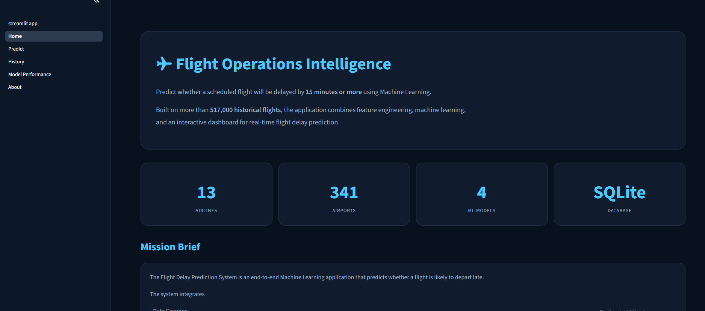
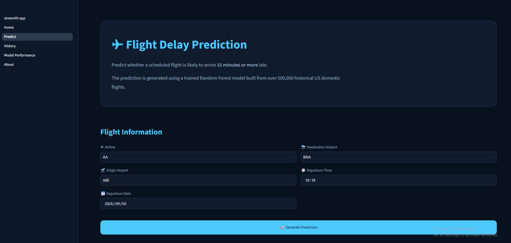
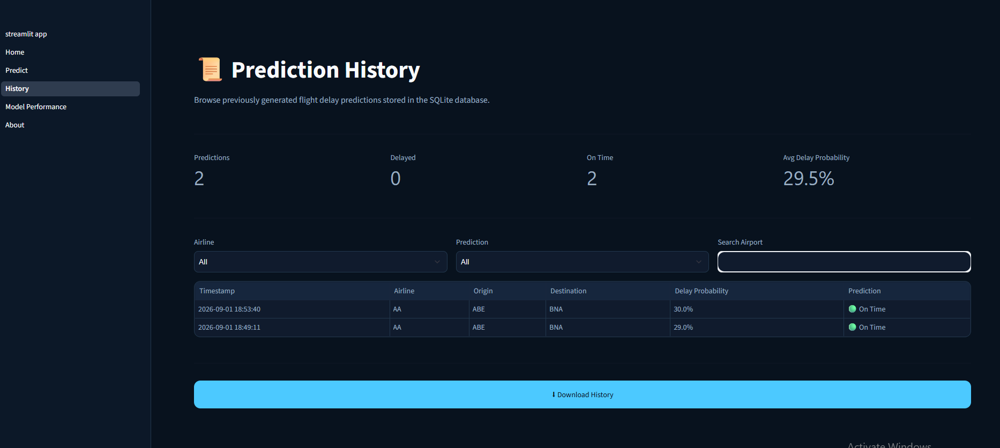
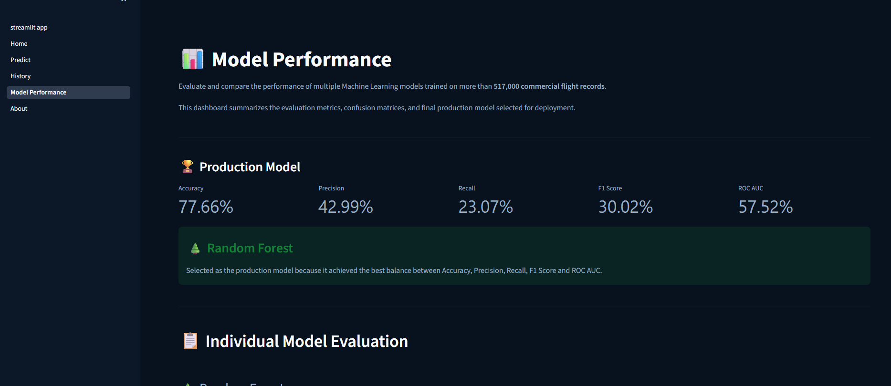
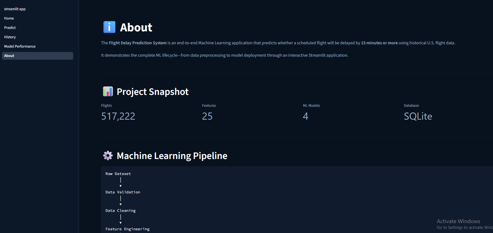

# Flight Delay Prediction System

## Project Report

---

# 1. Abstract

The Flight Delay Prediction System is an end-to-end Machine Learning application developed to predict whether a scheduled commercial flight will arrive fifteen minutes or more late. The project was built using historical flight data published by the United States Bureau of Transportation Statistics and combines data engineering, feature engineering, machine learning, database management, and web application development into a single integrated system.

Unlike projects that focus only on training a predictive model, this work was designed to simulate the workflow of a complete Machine Learning application. The project includes dataset validation, automated data cleaning, exploratory data analysis, feature engineering, preprocessing, model training, hyperparameter optimization, model evaluation, prediction services, SQLite database integration, and an interactive Streamlit dashboard.

Throughout development, emphasis was placed on writing modular, maintainable, and reusable code. Each stage of the pipeline was implemented as an independent component, allowing data processing, model training, evaluation, and inference to remain loosely coupled while working together as one system.

This report documents not only the final implementation, but also the engineering decisions, design choices, challenges encountered, and lessons learned during development. The objective is to provide both a technical description of the system and a personal engineering reference for future projects.


# 2. Introduction

Flight delays affect millions of passengers every year and create significant operational challenges for airlines and airports. Predicting delays before departure enables airlines to allocate resources more effectively while allowing passengers to make informed travel decisions.

The objective of this project was not to build the most accurate prediction model possible, but rather to understand and implement every stage involved in developing a complete Machine Learning application.

Instead of treating machine learning as a single model-training task, the project approaches it as an engineering system consisting of multiple interconnected components. These components include data acquisition, validation, preprocessing, feature engineering, model training, evaluation, deployment, database integration, and user interaction.

The application was developed using Python and Scikit-Learn for machine learning, SQLite for data persistence, and Streamlit for the interactive user interface. The final system provides users with delay predictions, estimated probabilities, prediction history, and comparative model performance through a modern dashboard.

Beyond the technical implementation, this project also served as an opportunity to practice software engineering principles such as modular architecture, separation of responsibilities, reusable components, and documentation of engineering decisions.


# 3. Problem Statement

Flight delays are influenced by multiple factors including airline operations, airport characteristics, scheduled departure time, route information, and historical patterns. Because these factors interact in complex ways, manually estimating whether a flight will be delayed can be difficult.

The objective of this project is to develop a Machine Learning system capable of predicting whether a scheduled flight will arrive fifteen minutes or more late.

The challenge is not only building a predictive model but also designing a complete system that can:

- Process raw aviation data
- Extract meaningful features
- Train and evaluate multiple machine learning models
- Provide reliable predictions for new flight schedules
- Store prediction history
- Present results through an interactive interface

The project addresses the following engineering problem:

> How can historical flight data be transformed into a reliable Machine Learning application that provides useful delay predictions before flight departure?

---

# 4. Objectives

The primary objective of this project was to design and implement an end-to-end Flight Delay Prediction System.

The specific objectives were:

## 4.1 Data Engineering Objectives

- Obtain and process real-world aviation data.
- Validate dataset structure and quality.
- Handle missing values and inconsistent records.
- Remove irrelevant or unavailable prediction features.
- Create a clean dataset suitable for machine learning.

---

## 4.2 Machine Learning Objectives

- Develop a classification model to predict flight delays.
- Compare multiple machine learning algorithms.
- Evaluate models using appropriate classification metrics.
- Optimize model performance using hyperparameter tuning.
- Select a suitable production model.

---

## 4.3 Software Engineering Objectives

- Design a modular project architecture.
- Separate data processing, training, inference, and application layers.
- Create reusable services for prediction.
- Store prediction history using a database.
- Build an interactive user interface.

---

## 4.4 Learning Objectives

This project was also developed as a learning exercise to understand how individual Machine Learning components combine into a complete application.

The goal was to gain practical experience with:

- Machine Learning workflows
- Data preprocessing pipelines
- Model deployment concepts
- Database integration
- Application architecture
- Engineering documentation

# 5. Dataset Description

## 5.1 Dataset Source

The Flight Delay Prediction System was developed using historical flight operation data obtained from the **United States Bureau of Transportation Statistics (BTS)**.

The dataset contains detailed information about commercial flights operated within the United States, including information related to airlines, airports, schedules, distances, delays, and operational outcomes.

The dataset was selected because flight delays are influenced by multiple operational factors, making it suitable for a supervised machine learning classification problem.

---

## 5.2 Dataset Overview

The original dataset contained flight-level records with information related to:

- Flight schedules
- Airline carriers
- Origin and destination airports
- Distance information
- Departure and arrival timings
- Delay information
- Operational status

After data cleaning and feature preparation, the final dataset used for model development contained:

| Component | Value |
|---|---:|
| Total Flight Records | 517,222 |
| Input Features | 25 |
| Target Variable | 1 |
| Numeric Features | 15 |
| Categorical Features | 9 |

---

## 5.3 Prediction Target

The objective of the system is a binary classification task.

The target variable is:

```
ARR_DEL15
```

The variable represents whether a flight arrival delay is:

| Value | Meaning |
|---|---|
| 0 | Flight arrived less than 15 minutes late |
| 1 | Flight arrived 15 minutes or more late |

The threshold of 15 minutes was selected because it is the standard delay classification used by aviation reporting systems.

---

# 5.4 Data Cleaning Decisions

Before model development, several preprocessing steps were performed to improve data quality and prevent incorrect learning patterns.

## Removing Cancelled Flights

Cancelled flights were removed because they do not represent normal arrival-delay prediction scenarios.

A cancelled flight does not experience a delay in the same way as an operating flight. Including these records could introduce misleading patterns into the model.

---

## Removing Diverted Flights

Diverted flights were excluded because diversion events represent exceptional operational situations that are different from normal delay prediction.

The objective of this project was to predict arrival-delay risk before flight operation.

---

## Removing Post-Departure Information

Several columns were removed because their values are only available after the flight has already started.

Examples:

- DEP_TIME
- ARR_TIME
- ARR_DELAY
- ACTUAL_ELAPSED_TIME
- AIR_TIME

Including these features would create **data leakage** because the model would receive information that would not be available during real prediction.

---

# 5.5 Feature and Target Separation

After cleaning, the dataset was separated into:

```
X → Input Features

y → Prediction Target
```

The final feature dataset:

```
Features Shape:
(517222, 25)

Target Shape:
(517222,)
```

The separation ensured that the model only learned from information available before flight departure.

---

# 5.6 Data Preprocessing

Machine learning algorithms require numerical input, therefore preprocessing was applied.

The preprocessing pipeline included:

## Numerical Features

Numerical features were processed using:

- Missing value handling
- Standard scaling

Examples:

- Distance
- Scheduled duration
- Departure hour

---

## Categorical Features

Categorical features were transformed using:

- One Hot Encoding

Examples:

- Airline carrier
- Origin airport
- Destination airport

---

## Final Feature Transformation

After preprocessing:

```
Original Features:

517,222 samples
25 features


Processed Features:

517,222 samples
1,522 features
```

The increase in feature count occurred because categorical variables were converted into numerical representations through one-hot encoding.

---

# 5.7 Dataset Challenges

During development, several challenges were identified:

## High Cardinality Features

Airport codes and route information created a large number of categorical values.

This increased the final feature space significantly.

---

## Feature Availability

Some columns initially appeared useful but were unavailable during prediction time.

These features were removed to maintain a realistic prediction scenario.

---

## Class Imbalance

Flight delays are naturally less frequent than on-time flights.

Therefore, evaluation metrics beyond accuracy were considered, including:

- Precision
- Recall
- F1 Score
- ROC-AUC


# 6. Project Workflow and Methodology

The Flight Delay Prediction System was developed using a structured Machine Learning workflow. The project was divided into multiple stages, where each stage focused on a specific engineering responsibility.

The complete workflow consists of:

1. Data Collection
2. Data Validation
3. Data Cleaning
4. Exploratory Data Analysis
5. Feature Engineering
6. Data Preprocessing
7. Model Development
8. Hyperparameter Optimization
9. Model Evaluation
10. Application Development
11. Prediction and Data Storage

---

# 6.1 Overall Workflow

The complete system workflow is:

```
Raw Flight Dataset

        │

        ▼

Data Validation

        │

        ▼

Data Cleaning

        │

        ▼

Exploratory Data Analysis

        │

        ▼

Feature Engineering

        │

        ▼

Data Preprocessing

        │

        ▼

Train/Test Split

        │

        ▼

Machine Learning Models

        │

        ▼

Hyperparameter Optimization

        │

        ▼

Model Evaluation

        │

        ▼

Saved ML Models

        │

        ▼

Prediction Service

        │

        ▼

Streamlit Application

        │

        ▼

SQLite Prediction Database
```

---

# 6.2 Data Collection

The first stage involved obtaining historical flight operation data from the U.S. Bureau of Transportation Statistics.

The dataset was selected because it contains real-world aviation information required to understand patterns associated with flight delays.

Important information included:

- Airline carrier information
- Airport information
- Scheduled departure time
- Route information
- Distance
- Historical delay status

---

# 6.3 Data Validation

Before performing any transformation, the dataset was validated to understand its structure and quality.

The validation process included:

- Checking dataset dimensions
- Identifying missing values
- Detecting duplicate records
- Verifying column data types
- Examining target distribution

This stage helped ensure that later processing steps were performed on reliable data.

---

# 6.4 Data Cleaning

The cleaning stage focused on improving data quality and removing information that could negatively affect model performance.

The following operations were performed:

- Removed duplicate records
- Removed cancelled flights
- Removed diverted flights
- Handled missing values
- Removed unavailable prediction features

A major consideration during this stage was avoiding data leakage.

Features that contain information after flight departure were removed because they would not be available during real-world prediction.

---

# 6.5 Exploratory Data Analysis

Exploratory Data Analysis (EDA) was performed to understand relationships between flight characteristics and delays.

The analysis included:

- Delay distribution analysis
- Airline delay comparison
- Airport delay analysis
- Route analysis
- Departure time analysis
- Distance-based analysis

The objective of EDA was not only visualization but also identifying patterns that could guide feature engineering decisions.

---

# 6.6 Feature Engineering

Feature engineering was performed to convert raw flight information into meaningful machine learning inputs.

Engineered feature categories included:

## Time-Based Features

Examples:

- Departure hour
- Day of week
- Month
- Scheduled duration

These features help capture operational patterns related to time.

---

## Airport Features

Airport-related information was extracted to represent differences between locations.

Examples:

- Origin airport
- Destination airport

---

## Route Features

Route information was used because certain flight paths may have different delay characteristics.

Examples:

- Origin-destination combination
- Route distance

---

## Distance Features

Distance-related attributes were included because flight duration and operational complexity can influence delay probability.

---

# 6.7 Data Preprocessing

After feature engineering, preprocessing was applied before model training.

The preprocessing pipeline consisted of:

## Numerical Processing

Numerical features were transformed using scaling techniques.

Purpose:

- Normalize feature ranges
- Improve model stability

---

## Categorical Processing

Categorical features were converted using One-Hot Encoding.

Purpose:

- Convert text-based categories into numerical representations
- Allow machine learning algorithms to process categorical information

---

The preprocessing pipeline was saved as:

```
models/preprocessor.pkl
```

Saving the preprocessing pipeline ensured that the same transformations were applied during future predictions.

---

# 6.8 Model Development

Multiple machine learning algorithms were trained and compared.

The selected models were:

- Logistic Regression
- Decision Tree
- Random Forest
- Gradient Boosting

The reason for training multiple models was to compare different learning approaches instead of assuming one algorithm would perform best.

---

# 6.9 Hyperparameter Optimization

After initial model training, hyperparameter optimization was performed.

The optimization process used:

- RandomizedSearchCV
- Five-fold Cross Validation

The purpose was to find better parameter combinations and improve generalization performance.

---

# 6.10 Model Evaluation

Each model was evaluated using classification metrics.

The evaluation metrics included:

- Accuracy
- Precision
- Recall
- F1 Score
- ROC-AUC
- Confusion Matrix

Accuracy alone was not considered sufficient because flight delay datasets naturally contain class imbalance.

---

# 6.11 Application Development

The trained models were integrated into a complete application.

The application consists of:

## Prediction Service

Responsible for:

- Loading trained models
- Applying preprocessing
- Generating predictions
- Returning probabilities

---

## Database Layer

SQLite was used to store:

- Flight prediction history
- Prediction timestamps
- Model outputs

---

## User Interface

A Streamlit dashboard was developed with:

- Flight input form
- Prediction results
- Model performance dashboard
- Prediction history
- Project information

---

# 6.12 Final System Workflow

A user interacts with the system as follows:

1. User enters flight details.
2. Application validates the input.
3. Prediction service processes features.
4. Saved preprocessing pipeline transforms inputs.
5. Machine learning model generates prediction.
6. Probability score is calculated.
7. Prediction result is displayed.
8. Prediction history is stored in SQLite.

This completes the transformation from raw aviation data into a usable Machine Learning application.

# 7. System Overview

The Flight Delay Prediction System was designed as a modular Machine Learning application rather than a single training script.

The system separates different responsibilities into independent components, allowing data processing, model development, inference, database operations, and user interaction to be maintained separately.

The architecture follows a layered design:

```
                    User
                     │
                     ▼

             Streamlit Application
                     │
                     ▼

             Prediction Service
                     │
        ┌────────────┴────────────┐
        │                         │
        ▼                         ▼

 Feature Builder             Model Loader

        │                         │
        └────────────┬────────────┘
                     │
                     ▼

           Machine Learning Model

                     │
                     ▼

              Prediction Result

                     │
                     ▼

              SQLite Database
```

---

# 7.1 Project Architecture

The project directory was organized into different layers based on responsibility.

```
FDP/

│
├── app/
│
├── src/
│
├── scripts/
│
├── models/
│
├── database/
│
├── data/
│
├── reports/
│
└── results/
```

Each directory has a specific role in the overall system.

---

# 7.2 Application Layer

Location:

```
app/
```

The application layer contains the Streamlit user interface.

Responsibilities:

- Collect user inputs
- Display predictions
- Display model performance
- Display prediction history
- Provide project information

The application was divided into multiple pages:

```
app/

├── streamlit_app.py

└── pages/

    ├── 1_Home.py

    ├── 2_Predict.py

    ├── 3_History.py

    ├── 4_Model_Performance.py

    └── 5_About.py
```

This structure allows each feature of the dashboard to remain independent.

---

# 7.3 Source Code Layer

Location:

```
src/
```

The `src` directory contains the reusable application logic.

The purpose of this layer is to separate business logic from the user interface.

---

## Data Module

Location:

```
src/data/
```

Responsibilities:

- Loading datasets
- Cleaning data
- Validating data
- Profiling datasets

Components include:

```
loader.py

cleaner.py

validator.py

profiler.py
```

---

## Feature Engineering Module

Location:

```
src/features/
```

Responsibilities:

- Creating machine learning features
- Transforming raw flight information
- Preparing inputs for prediction

Component:

```
engineer.py
```

---

## Model Module

Location:

```
src/models/
```

Responsibilities:

- Model training
- Preprocessing
- Evaluation
- Optimization

Components:

```
trainer.py

preprocessor.py

optimizer.py

evaluator.py

splitter.py
```

---

## Inference Module

Location:

```
src/inference/
```

This module handles production prediction.

Responsibilities:

- Loading trained models
- Preparing user input
- Running predictions
- Returning prediction probabilities

Components:

```
predictor.py

predict_service.py

feature_builder.py
```

The separation of inference from training allows the prediction system to operate independently after model development.

---

## Database Module

Location:

```
src/database/
```

Responsibilities:

- Database connection management
- Query execution
- Prediction storage
- Historical data retrieval

Components:

```
database.py

database_builder.py

queries.py
```

---

# 7.4 Training Pipeline Layer

Location:

```
scripts/
```

The scripts directory contains executable workflows for different stages of machine learning development.

```
scripts/

├── build_database.py

├── eda.py

├── evaluate.py

├── optimize.py

├── preprocess.py

├── profile.py

└── train.py
```

Each script performs a specific task instead of combining the entire workflow into one large file.

This improves:

- Debugging
- Maintainability
- Reusability
- Understanding of the ML pipeline

---

# 7.5 Model Storage

Location:

```
models/
```

This directory stores trained machine learning artifacts.

Contents include:

```
random_forest.joblib

gradient_boosting.joblib

decision_tree.joblib

logistic_regression.joblib

preprocessor.pkl
```

The trained models were saved using Joblib because it efficiently serializes Scikit-Learn models and allows them to be loaded during inference.

---

# 7.6 Database Layer

Location:

```
database/
```

The system uses SQLite as the database engine.

The database stores:

- Airline information
- Airport information
- Route information
- Prediction history

The database enables persistence between application sessions.

---

# 7.7 Data Storage

Location:

```
data/
```

The data directory contains:

```
data/

├── raw/

└── processed/
```

Raw data represents the original downloaded dataset.

Processed data contains:

- Cleaned datasets
- Feature datasets
- Train-test splits
- Final ML inputs

Keeping raw and processed data separate prevents accidental modification of original data.

---

# 7.8 Reporting Layer

Location:

```
reports/
```

This directory stores analytical outputs generated during development.

Examples:

- Missing value reports
- Dataset statistics
- EDA visualizations
- Statistical analysis results

These reports helped understand the dataset before model training.

---

# 7.9 Evaluation Results

Location:

```
results/
```

The results directory contains model evaluation outputs.

Examples:

- Accuracy metrics
- Confusion matrices
- Model comparison results

These files provide evidence for model selection decisions.

---

# 7.10 Design Philosophy

The main architectural principle followed during development was:

> Each component should have one clear responsibility.

Examples:

- Data modules handle data.
- Model modules handle machine learning.
- Database modules handle persistence.
- Streamlit handles presentation.

This separation makes future improvements easier, such as replacing SQLite with PostgreSQL, replacing Streamlit with an API frontend, or deploying the prediction service independently.

# 8. Model Development and Evaluation

## 8.1 Machine Learning Problem Definition

The Flight Delay Prediction System was formulated as a supervised binary classification problem.

The objective was to predict whether a flight would arrive 15 minutes or more late.

The target classes were:

| Class | Meaning |
|---|---|
| 0 | Flight on time |
| 1 | Flight delayed |

The model receives information available before departure and produces:

- Predicted delay status
- Probability of delay
- Probability of being on time

---

# 8.2 Model Selection Strategy

Instead of selecting a single algorithm immediately, multiple machine learning approaches were implemented and compared.

The purpose of comparing different models was to understand how different learning methods perform on the flight delay prediction problem.

The selected algorithms were:

---

## Logistic Regression

Logistic Regression was selected as a baseline classification model.

Reasons for selection:

- Simple and interpretable
- Provides probability estimates
- Suitable for binary classification
- Provides a performance reference for more complex models

---

## Decision Tree

Decision Tree was selected because it can capture non-linear relationships between features.

Advantages:

- Easy interpretation
- Handles feature interactions
- Requires minimal preprocessing assumptions

However, individual decision trees can overfit, which motivated testing ensemble approaches.

---

## Random Forest

Random Forest was selected as an ensemble learning method.

It combines multiple decision trees to improve:

- Generalization
- Stability
- Resistance to overfitting

Random Forest was expected to perform better than a single decision tree because flight delays depend on multiple interacting factors.

---

## Gradient Boosting

Gradient Boosting was selected because it builds models sequentially, where each new model attempts to correct previous errors.

Advantages:

- Strong predictive performance
- Captures complex relationships
- Effective for structured tabular datasets

---

# 8.3 Training Pipeline

The training workflow followed these steps:

```
Processed Dataset

        │

        ▼

Train/Test Split

        │

        ▼

Model Initialization

        │

        ▼

Model Training

        │

        ▼

Model Saving

        │

        ▼

Evaluation
```

---

# 8.4 Train-Test Split

The processed dataset was divided into training and testing subsets.

The split used:

```
Training Samples:
413,777

Testing Samples:
103,445
```

The training set was used for learning model parameters, while the testing set was reserved for final performance evaluation.

This separation ensured that evaluation results represented performance on unseen data.

---

# 8.5 Initial Model Training

Four classification models were trained:

```
Logistic Regression

Decision Tree

Random Forest

Gradient Boosting
```

After training, each model was saved using Joblib.

Saved artifacts:

```
models/

├── Logistic Regression.joblib

├── decision_tree.joblib

├── random_forest.joblib

└── gradient_boosting.joblib
```

Saving models separately allows the application to load trained models without repeating the training process.

---

# 8.6 Hyperparameter Optimization

After baseline training, hyperparameter optimization was performed to improve model performance.

The optimization process used:

- RandomizedSearchCV
- Five-fold cross validation

The purpose was to evaluate multiple parameter combinations and identify configurations that generalized better.

---

# 8.7 Logistic Regression Optimization

Search Process:

```
5 folds × 10 parameter combinations

Total Fits:
50
```

Best configuration:

```
Solver:
lbfgs

C:
0.01
```

Best Cross Validation Score:

```
0.3910
```

---

# 8.8 Decision Tree Optimization

Search Process:

```
5 folds × 10 parameter combinations

Total Fits:
50
```

Best configuration:

```
max_depth:
None

min_samples_split:
10

min_samples_leaf:
4
```

Best Cross Validation Score:

```
0.3947
```

---

# 8.9 Random Forest Optimization

Random Forest optimization was performed using the same cross-validation strategy.

Search Process:

```
5 folds × multiple parameter combinations
```

The optimization focused on improving ensemble performance by tuning tree-related parameters.

Parameters considered included:

- Number of estimators
- Tree depth
- Minimum samples per split
- Minimum samples per leaf

---

# 8.10 Gradient Boosting Optimization

Gradient Boosting optimization was performed to identify parameters that improved sequential learning performance.

Parameters considered included:

- Number of boosting stages
- Learning rate
- Tree depth
- Minimum samples parameters

---

# 8.11 Evaluation Metrics

Because flight delay prediction is a classification problem, multiple metrics were used.

---

## Accuracy

Measures the overall percentage of correct predictions.

However, accuracy alone can be misleading when classes are imbalanced.

---

## Precision

Measures how many predicted delays were actually delays.

Important because unnecessary delay warnings can reduce trust in the system.

---

## Recall

Measures how many actual delayed flights were successfully identified.

Important because missing a delayed flight can affect operational decisions.

---

## F1 Score

Combines precision and recall into a single metric.

Useful when both false positives and false negatives matter.

---

## ROC-AUC

Measures the model's ability to separate delayed and non-delayed flights across different classification thresholds.

---

## Confusion Matrix

Confusion matrices were generated to analyze:

- True Positives
- True Negatives
- False Positives
- False Negatives

---

# 8.12 Model Evaluation Approach

The final model comparison was based on:

- Predictive performance
- Generalization ability
- Classification metrics
- Practical usability

The objective was not only to find the highest score, but to select a model that balances prediction quality and reliability.

---

# 8.13 Engineering Decisions

Several decisions were made during model development:

## Decision 1: Train Multiple Models

Instead of assuming one algorithm would perform best, multiple approaches were implemented.

Reason:

Different algorithms capture different patterns in structured datasets.

---

## Decision 2: Save Preprocessing Pipeline

The preprocessing object was saved separately:

```
models/preprocessor.pkl
```

Reason:

The exact same transformations must be applied during inference as during training.

---

## Decision 3: Use Cross Validation

Five-fold cross validation was used during optimization.

Reason:

A single validation split may produce unstable results. Cross validation provides a more reliable estimate of model performance.

---

## Decision 4: Evaluate More Than Accuracy

Multiple metrics were considered.

Reason:

Flight delay datasets naturally contain imbalance between delayed and non-delayed flights. A model with high accuracy may still fail to detect delays.

# 9. Application Design and Deployment

## 9.1 Application Overview

After completing the Machine Learning pipeline, the trained models were integrated into an interactive application.

The objective was to transform the trained prediction system into a practical tool where users can provide flight information and receive delay predictions.

The application was developed using **Streamlit**, allowing rapid development of an interactive Machine Learning dashboard using Python.

The final application provides:

- Flight delay prediction
- Delay probability estimation
- Prediction history tracking
- Model performance visualization
- Project documentation overview

---

# 9.2 Application Architecture

The application follows a layered architecture.

```
                 User

                  │

                  ▼

        Streamlit Dashboard

                  │

                  ▼

          Prediction Service

                  │

        ┌─────────┴─────────┐

        ▼                   ▼

 Feature Builder       Model Loader

        │                   │

        └─────────┬─────────┘

                  ▼

        Machine Learning Model

                  │

                  ▼

          Prediction Output

                  │

                  ▼

            SQLite Database
```

Each layer has a separate responsibility.

---

# 9.3 Streamlit Dashboard

The user interface was developed using Streamlit because it provides:

- Fast application development
- Native Python integration
- Easy visualization support
- Simple deployment workflow

The dashboard was divided into multiple pages.

```
app/

├── streamlit_app.py

└── pages/

    ├── 1_Home.py

    ├── 2_Predict.py

    ├── 3_History.py

    ├── 4_Model_Performance.py

    └── 5_About.py
```

# 9.4 Application Screenshots

The following screenshots show the main views of the Streamlit application.

### Home Page



### Prediction Page



### Prediction History



### Model Performance



### About Page



---

# 9.5 Home Page

The Home page provides an overview of the system.

Features:

- Project introduction
- Dataset information
- System statistics
- Technology stack
- Machine learning pipeline explanation

The purpose of this page is to help users understand the application before interacting with predictions.

---

# 9.6 Prediction Page

The Prediction page is the main functionality of the application.

Users provide:

- Airline
- Origin airport
- Destination airport
- Departure date
- Departure time

The application then performs prediction.

---

## Prediction Workflow

```
User Input

    │

    ▼

Input Validation

    │

    ▼

Feature Construction

    │

    ▼

Preprocessing Pipeline

    │

    ▼

Machine Learning Model

    │

    ▼

Prediction Probability

    │

    ▼

Result Display
```

---

# 9.7 Prediction Service

The prediction logic was separated from the Streamlit interface.

Location:

```
src/inference/
```

Main components:

```
predictor.py

predict_service.py

feature_builder.py
```

Responsibilities:

## Feature Builder

Converts user input into the format expected by the model.

Example:

User Input:

```
Airline:
AA

Origin:
JFK

Destination:
LAX
```

Converted into:

```
Machine Learning Feature Vector
```

---

## Model Loader

Loads:

```
models/random_forest.joblib

models/preprocessor.pkl
```

The application does not retrain models during prediction.

Instead, it loads previously trained artifacts.

---

## Prediction Service

Handles:

- Input processing
- Model execution
- Probability calculation
- Result formatting

---

# 9.8 Prediction Output

The application provides:

## Delay Probability

Example:

```
Delay Probability:
63.4%
```

Represents the estimated chance of delay.

---

## On-Time Probability

Example:

```
On-Time Probability:
36.6%
```

Represents the estimated chance of the flight arriving without delay.

---

## Prediction Status

The system displays:

```
Flight Likely Delayed

or

Flight Likely On Time
```

---

# 9.9 Database Integration

SQLite was selected as the database system.

The database stores prediction history.

Database location:

```
database/

flight_delay.db
```

---

## Stored Information

The prediction table contains:

| Field | Description |
|---|---|
| Timestamp | Prediction generation time |
| Airline | Selected airline |
| Origin | Departure airport |
| Destination | Arrival airport |
| Probability | Delay probability |
| Prediction | Final classification |

---

# 9.10 Why SQLite Was Selected

SQLite was chosen because:

- It requires no external database server
- It is lightweight
- It integrates easily with Python
- It is suitable for a student-level deployment project

For larger production systems, this could be replaced with:

- PostgreSQL
- MySQL
- Cloud database services

---

# 9.11 Prediction History

The History page retrieves previous predictions from SQLite.

Users can view:

- Previous flight inputs
- Prediction probabilities
- Prediction results
- Prediction timestamps

This feature demonstrates database persistence.

---

# 9.12 Model Performance Dashboard

The Model Performance page provides transparency into model behavior.

It displays:

- Accuracy
- Precision
- Recall
- F1 Score
- ROC-AUC
- Confusion Matrix

The purpose of this page is to show how different models performed before selecting the final approach.

---

# 9.13 Error Handling

The application includes validation and error handling.

Examples:

## Date Validation

Past departure dates are rejected.

Reason:

A future prediction system cannot predict historical flights through the user interface.

---

## Missing Data Handling

Input fields are controlled using dropdown selections.

Reason:

This prevents invalid airline or airport values from entering the prediction pipeline.

---

## Model Loading Protection

The prediction service loads models through reusable functions.

Reason:

Avoid unnecessary repeated loading and improve application performance.

---

# 9.14 Deployment Considerations

The current system is designed as a local Machine Learning application.

Possible future deployment architecture:

```
Frontend

    │

    ▼

REST API

    │

    ▼

ML Prediction Service

    │

    ▼

Database
```

A future version could replace Streamlit prediction calls with an API service using:

- FastAPI
- Flask
- Cloud deployment platforms

---

# 9.15 Engineering Decisions

## Decision 1: Separate UI and ML Logic

The Streamlit pages do not directly contain model logic.

Reason:

Separating responsibilities improves maintainability and allows future replacement of the frontend.

---

## Decision 2: Use Saved Models

Models are trained separately and loaded during inference.

Reason:

Training is computationally expensive and should not occur during user interaction.

---

## Decision 3: Store Predictions

Prediction results are stored in SQLite.

Reason:

Allows analysis of previous predictions and demonstrates real application behavior.

---

## Decision 4: Build a Multi-page Dashboard

The application was divided into multiple pages.

Reason:

A single large page would reduce usability and make future expansion difficult.


# 10. Engineering Decision Log

This section documents the major engineering decisions made during the development of the Flight Delay Prediction System.

The purpose of this section is to record the reasoning behind technical choices, alternatives considered, and possible improvements for future versions.

The project was developed as a student engineering project with the goal of understanding the complete Machine Learning development lifecycle.

---

# 10.1 Project Architecture Decision

## Decision

The project was organized into separate layers:

```
app/

src/

scripts/

models/

database/

data/

reports/

results/
```

---

## Reason

Initially, a Machine Learning project can be implemented as a single notebook or script.

However, this approach becomes difficult to maintain as the project grows.

Separating responsibilities makes the system easier to:

- Debug
- Extend
- Test
- Understand

---

## Alternative Considered

A single Python file containing:

- Data loading
- Preprocessing
- Training
- Prediction
- UI code

---

## Why It Was Not Selected

A single file mixes multiple responsibilities.

For example:

- Changing the UI could affect ML logic.
- Updating preprocessing could break prediction.
- Debugging becomes harder.

---

## Future Improvement

For a production system, the architecture could be extended into:

```
Frontend

    ↓

API Layer

    ↓

ML Service

    ↓

Database

    ↓

Monitoring System
```

---

# 10.2 Decision: Using Streamlit for Frontend

## Decision

Streamlit was selected for building the user interface.

---

## Reason

The main goal of the project was to demonstrate Machine Learning engineering rather than frontend development.

Streamlit provided:

- Fast development
- Python-only implementation
- Built-in charts and components
- Easy ML model integration

---

## Alternative Considered

### React + Backend API

A professional production system could use:

```
React Frontend

+

FastAPI Backend
```

---

## Why It Was Not Selected

The project scope focused on Machine Learning workflow.

Building a complete frontend would increase development time without improving the ML learning objective.

---

## Future Improvement

The Streamlit interface can later be replaced with:

- React
- Angular
- Mobile application

while keeping the prediction service unchanged.

---

# 10.3 Decision: Using SQLite Database

## Decision

SQLite was selected as the database system.

---

## Reason

The application required persistent storage for:

- Prediction history
- Flight information
- User prediction records

SQLite provides:

- Zero configuration
- Local storage
- Python compatibility
- Lightweight deployment

---

## Alternative Considered

### PostgreSQL / MySQL

---

## Why It Was Not Selected

For a student project, managing an external database server would add unnecessary complexity.

The application does not currently require:

- Multiple users
- Distributed storage
- High transaction volume

---

## Future Improvement

A production deployment could migrate to:

- PostgreSQL
- AWS RDS
- Cloud SQL

without changing the application architecture significantly.

---

# 10.4 Decision: Training Multiple Machine Learning Models

## Decision

Four different algorithms were implemented:

- Logistic Regression
- Decision Tree
- Random Forest
- Gradient Boosting

---

## Reason

Instead of assuming one algorithm would perform best, multiple approaches were compared.

Different algorithms learn different patterns.

For example:

- Logistic Regression learns linear relationships.
- Decision Trees learn rule-based patterns.
- Random Forest learns through multiple decision trees.
- Gradient Boosting improves predictions sequentially.

---

## Alternative Considered

Using only one advanced model.

Example:

Random Forest only.

---

## Why It Was Not Selected

Without comparison, it is difficult to justify model selection.

Testing multiple models provides evidence-based selection.

---

## Future Improvement

Future versions could evaluate:

- XGBoost
- LightGBM
- Neural Networks
- Deep Learning approaches

---

# 10.5 Decision: Avoiding Data Leakage

## Decision

Features only available after flight departure were removed.

Examples:

- Actual arrival time
- Arrival delay
- Actual flight duration

---

## Reason

These features would allow the model to see future information.

This creates unrealistic performance because the model would use information unavailable during real prediction.

---

## Alternative Considered

Keeping all available columns to maximize accuracy.

---

## Why It Was Not Selected

A model with artificial accuracy is not useful in a real-world prediction scenario.

The goal was realistic prediction before departure.

---

## Future Improvement

Feature availability checks can be automated during the preprocessing stage.

---

# 10.6 Decision: Using One-Hot Encoding

## Decision

Categorical features were converted using One-Hot Encoding.

Examples:

- Airline
- Airport
- Route

---

## Reason

Machine learning algorithms require numerical input.

One-Hot Encoding allows categorical information to be represented numerically without assuming artificial ordering.

---

## Alternative Considered

Label Encoding.

---

## Why It Was Not Selected

Label Encoding creates numerical relationships that do not exist.

Example:

```
Airline A = 1

Airline B = 2

Airline C = 3
```

The model may incorrectly interpret Airline C as having a higher value than Airline A.

---

## Future Improvement

For high-cardinality features, possible alternatives include:

- Target Encoding
- Embeddings
- Frequency Encoding

---

# 10.7 Decision: Saving the Preprocessing Pipeline

## Decision

The preprocessing pipeline was saved separately.

File:

```
models/preprocessor.pkl
```

---

## Reason

The exact same transformations used during training must be applied during prediction.

Without this:

Training data and prediction data may have different formats.

---

## Alternative Considered

Manually recreating preprocessing during inference.

---

## Why It Was Not Selected

Manual recreation increases the possibility of:

- Missing transformations
- Incorrect feature ordering
- Prediction errors

---

# 10.8 Decision: Using Model Evaluation Metrics Beyond Accuracy

## Decision

Multiple evaluation metrics were used:

- Accuracy
- Precision
- Recall
- F1 Score
- ROC-AUC
- Confusion Matrix

---

## Reason

Flight delay prediction involves class imbalance.

A model can achieve high accuracy while failing to detect delayed flights.

---

## Alternative Considered

Using only accuracy.

---

## Why It Was Not Selected

Accuracy does not show:

- False delays
- Missed delays
- Model confidence

---

# 10.9 Decision: Creating a Prediction History System

## Decision

Prediction results are stored in SQLite.

---

## Reason

A real application should maintain historical records.

This enables:

- Future analysis
- User history
- Model monitoring

---

## Alternative Considered

Displaying predictions without storing them.

---

## Why It Was Not Selected

Temporary predictions disappear after application shutdown.

---

# 10.10 Decision: Modular Code Structure

## Decision

Reusable components were separated into modules.

Examples:

```
src/inference/

src/database/

src/models/

src/features/
```

---

## Reason

Each component should have a single responsibility.

Benefits:

- Easier debugging
- Easier testing
- Easier replacement of components

---

## Future Improvement

Future versions could introduce:

- Dependency injection
- Automated testing pipelines
- CI/CD workflows
- Containerization using Docker

---

# 10.11 Overall Engineering Philosophy

The main engineering principle followed throughout the project was:

> Build a system that is understandable, maintainable, and extendable rather than only optimizing for a single performance score.

Every technical decision was made by balancing:

- Project scope
- Learning objectives
- Maintainability
- Real-world applicability

The final system demonstrates the complete journey from raw aviation data to a functional Machine Learning application.
